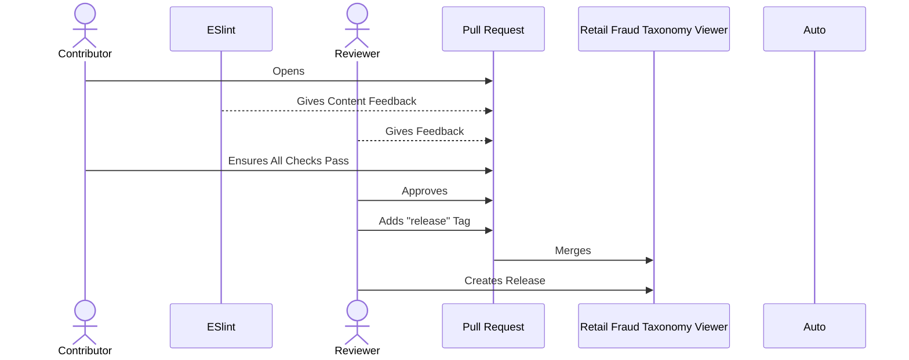

# Contributing

Thanks for your interest in contributing to **Retail Fraud Taxonomy Viewer!**

## Getting Started

Retail Fraud Taxonomy Viewer is a community owned and maintained tool, and contributions are the heart of keeping this information as relevant and applicable to new users as possible. All of our code, content, everything you see in Retail Fraud Taxonomy Viewer is in [GitHub](https://github.com/target/retail-fraud-taxonomy-viewer/).
## Expectations

Expectations for contributors is outlined in our [Contributor Code of Conduct](./CODE_OF_CONDUCT.md).

## How Can I Contribute?

### Reporting Bugs

[Create a new issue](#using-github-issues) on our repo using the "Bug" template. Try to fill out as much information as you can, but don't worry if you leave a section blank.

### Requesting New Features

[Create a new issue](#using-github-issues) on our repo using the "Feature Request" template. Try to fill out as much information as you can, but don't worry if you leave a section blank.

### Providing Feedback

There are a few ways to provide feedback. If you would like to provide general feedback or on specific pieces of content on Retail Fraud Taxonomy Viewer, you can:

- use any of the methods in the previous "Providing Feedback" list
- provide a "thumbs up" or "thumbs down" on the content's web page in Retail Fraud Taxonomy Viewer
- [Create a new issue](#using-github-issues) on our repo using the "Content Feedback" template
- reach out directly to the contributor
### Contributing Content

Content for Retail Fraud Taxonomy Viewer is community owned. Keeping Retail Fraud Taxonomy Viewer up-to-date is designed to be as uncomplicated as possible. All content is managed through json files in [`/src/content/techniques`](https://github.com/target/retail-fraud-taxonomy-viewer/tree/main/src/content/techniques).

First consider, should this exist in Retail Fraud Taxonomy Viewer?

Adding new content/technique is done by creating a json file in the [`src/content/techniques`](https://github.com/target/retail-fraud-taxonomy-viewer/tree/main/src/content/techniques) directory. Editing existing content in Retail Fraud Taxonomy Viewer is done by [creating a fork](https://github.com/target/retail-fraud-taxonomy-viewer/fork) of Retail Fraud Taxonomy Viewer, modifying the appropriate file, and opening a [new pull request](https://github.com/target/retail-fraud-taxonomy-viewer/pulls).

The front matter spec for each content type can be found in the [reference section](./README.md) of our documentation.

The general step by step flow creating new content is:

1. [Create a fork](https://github.com/target/retail-fraud-taxonomy-viewer/fork) of the Retail Fraud Taxonomy Viewer repo
2. Add the content json in the right content directory
3. [Create a PR](#the-pull-request-pr-process)

#### Only a quick fix?

Did you know you can [edit files directly](https://docs.github.com/en/repositories/working-with-files/managing-files/editing-files) in the GitHub UI? This is the fastest way to contribute small updates such as fixing typo's, adding small paragraphs, adding links, and updating metadata.
### Contributing Code

The frontend is written in [React](https://create-react-app.dev).
## Directories

Here is a brief explanation of the layout of the Retail Fraud Taxonomy Viewer repo to help determine where to start:

- `src/content/` - where all Retail Fraud Taxonomy Viewer content like resources live
- `public/` - static assets used in the UI (includes content assets, too)
- `src/` - source code

## Submission Process

Whether you're contributing new content (Technique, sub-technique, etc.) or new code (a new feature or fix in the UI), our process for contributions happens primarily within our GitHub [repository](https://github.com/target/retail-fraud-taxonomy-viewer) for Retail Fraud Taxonomy Viewer as either a [new Pull Request (PR)](https://github.com/target/retail-fraud-taxonomy-viewer/pulls) or a [new Issue](https://github.com/target/retail-fraud-taxonomy-viewer/issues).

- Learn about Issues in GitHub's [documentation](https://docs.github.com/en/issues)
- Learn more about PRs in [GitHub's Pull Request documentation](https://docs.github.com/en/pull-requests).

### Using GitHub Issues

An issue is a way of telling us about something like the following

- a typo in content (technique, sub-technique, etc.)
- suggesting a new feature
- an idea for a new resource or guide even if you can't make the change yourself
- report a bug or an error encountered in Retail Fraud Taxonomy Viewer

Issues are always welcome no matter how big or small. They offer a way to give feedback or suggestions without committing yourself to the implementation details.

  
Click to see the how to submit a new Issue

1. Navigate to the [Issues page](https://github.com/target/retail-fraud-taxonomy-viewer/issues) of the [Retail Fraud Taxonomy Viewer repository](https://github.com/target/retail-fraud-taxonomy-viewer), click on the ["New Issue"](https://github.com/target/retail-fraud-taxonomy-viewer/issues/new/choose) button.

1. Select from one of the templates, or open a blank issue.

2. Modify the title so that it helps us understand at a glance what you're looking to tell.

   - Try to scope the idea if it pertains to a new feature, a new or updated Resource, Guide etc. and include that at the start of the title.

   - 

     
Examples of Good Titles

     - Content Feedback: Add new content
     - Bug: Clicking Save Collection Crashes in Some Instances
     - Suggestion: Change font from wingdings for better readability
     

1. Fill in any of the requested template information or add supporting context to help us understand how we might resolve this particular issue.

2. Participate in discussion if questions are asked and if you're feeling especially helpful you could also participate in the resolution process by following the PR Process below.

3. :tada: Pat yourself on the back for helping make Retail Fraud Taxonomy Viewer's documentation and knowledge stay relevant and up-to-date!

### The Pull Request (PR) Process

Pull requests are our preferred method of integrating new content, edits to existing content, implementing new features, etc.

  
Click to see how to open a new Pull Request

1. [Fork the Retail Fraud Taxonomy Viewer Repo](https://github.com/target/retail-fraud-taxonomy-viewer/fork) into a convenient location for you to push changes.

1. Implement your content/code changes by pushing changes to your forked copy of Retail Fraud Taxonomy Viewer while making note to follow the relevant sections below for specifics around content or code contributions.

1. Open a [new Pull Request (PR)](https://github.com/target/retail-fraud-taxonomy-viewer/compare) from your fork back to the `main` branch of the Retail Fraud Taxonomy Viewer repository.

1. Follow the directions and fill in the information from the [PR Template](https://github.com/target/retail-fraud-taxonomy-viewer/blob/main/.github/pull_request_template.md) (this should automatically appear in the body of the PR).

1. Pick a relevant title for the PR that would look nice and be descriptive enough for an end user to read in the "What's New?" section in Retail Fraud Taxonomy Viewer.

   - This is editable so do your best guess and we can help craft the language as needed.

   - 

     
Examples of Good Titles

     - add new Golden Pattern "How to write a Golden Pattern"
     - marked Resource 'Concept Board' as deprecated
     - fixed spacing issue within guides of a single step length
     

1. Wait for reviewers to take a look at the PR to provide any relevant feedback or requested changes.

   - Typically feedback comes quick as we aim to be fairly timely with responses, but this could vary based on time of day/week and amount of PRs/Issues opened so we ask for your patience :smile:
   - Please review our [Code of Conduct](./CODE_OF_CONDUCT.md) as it pertains to your contribution

2. :tada: Celebrate by knowing that you've materially changed the engineering environment towards the better by giving your contributions back to the community at-large! You're a rock star and we want more of you around!

## Release Process

We use [Auto](https://intuit.github.io/auto/index) to help automate our releases through pull requests (PRs)

The Pull Request labels `patch`, `minor`, `major`, `documentation`, `internal` and `release` help us organize which PRs make it into our release notes of our [CHANGELOG](https://github.com/target/retail-fraud-taxonomy-viewer/blob/main/CHANGELOG.md "A log file containing a chronological list of human readable changes") as well as what version our application bumps up to.

> [!IMPORTANT]
> Note: the `release` tag is required to push updates to production

View Label Definitions

- `documentation` includes updating a typo in a resource, adjusting a guide review date, and other content/documentation related changes. This doesn't trigger a version bump except if paired with a `release` label and no other recent PRs then it will be treated like a `patch`.
- `patch` from [SemVer](https://semver.org/). This includes things like correcting a small bug in the code, tweaking small UI styles, and other really small fixes.
- `minor` from [SemVer](https://semver.org/). Use this for adding a new UI feature, and anything that feels more like "something new" rather than "something updated".
- `major` from [SemVer](https://semver.org/). These things typically include breaking changes at a bare minimum, but it might also be use in cases where there is such a substantial refresh or underlying update that warrants a "new era of code" in a way.
- `internal` is used for anything that we don't want showing in a customer facing UI. These might include things like updating the GitHub `README.md`, modifying part of the CI, clarifying language in our "in-code" docs.
- `release` is the most important tag as this is what tells Auto to actually go through the process of updating the CHANGELOG to incorporate all the latest PRs and to create a new versioned release on our [GitHub release](https://github.com/target/retail-fraud-taxonomy-viewer/releases).

After all of the feedback has been addressed and the PR has gotten an approval by relevant reviews, an administrator will merge your PR into the `main` branch of Retail Fraud Taxonomy Viewer. Doing this kicks of a series of a few more events before your changes show up live in our [Prod Environment](https://target.github.io/retail-fraud-taxonomy-viewer/).

- After you raise a pull request:

  - If there is a release planned, once the reviewer reviews and merges the pull request he/she also will manually release it to PROD.

## What you can expect

